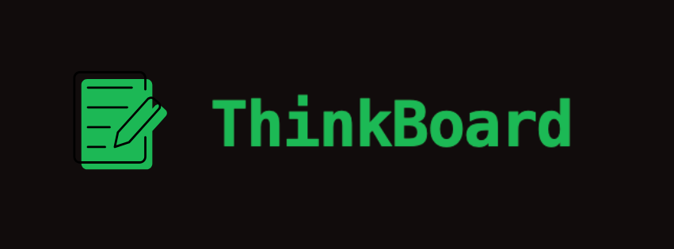
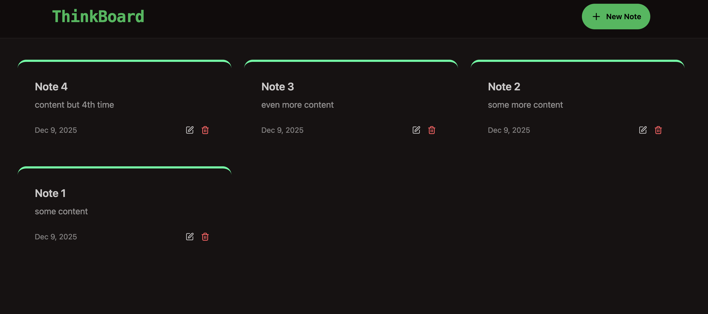

<p align="center">
  
</p>
<p align="center">
  <a href="https://thinkboard-8vp8.onrender.com"/>
    
  </a>
</p>
<br>

A collaborative note-taking and idea management platform built on the **MERN stack** with rate limiting, modern UI, and smooth developer experience.
<br>
<br>

<span>
  
  
  
  
  
  
  
  
</span>


---

---


## 🌟 Features

- ✍️ Create, edit, and delete notes with a smooth React-based interface.
- 🌈 Modern, responsive design using **Tailwind CSS** and **DaisyUI**.
- 🔔 User-friendly notifications with **react-hot-toast** for actions like create/update/delete.
- ⚡ Backend rate limiting powered by **Upstash Redis** to protect endpoints from abuse.
- ☁️ Production deployment using **Railway**, backed by **MongoDB** for persistence.

---


## 🛠️ Tech Stack

| Layer        | Technologies                                           |
|-------------|---------------------------------------------------------|
| Frontend    | React, Tailwind CSS, DaisyUI, React-Hot-Toast           |
| Backend     | Node.js, Express.js                                     |
| Database    | MongoDB (Atlas or self-hosted)                          |
| Rate limit  | Upstash Redis                                           |
| Deployment  | Railway                                                 |
| Tooling     | Git, GitHub                                             |

---

## ⚙️ Installation & Setup

1. **Clone the repository**  
   ```bash
   git clone https://github.com/vansh-09/ThinkBoard.git
   cd ThinkBoard
   ```

2. **Install dependencies**  
   ```bash
   npm install
   cd client && npm install
   ```

3. **Environment variables**  
   ```env
   MONGO_URI=your_mongodb_connection_string
   REDIS_URL=your_upstash_redis_url
   ```

4. **Run development**  
   ```bash
   npm run server
   cd client && npm start
   ```

---

## 🧩 Suggested Folder Structure

```
ThinkBoard/
├── client/
│   ├── src/
│   │   ├── components/
│   │   ├── pages/
│   │   └── hooks/
│   └── package.json
├── server/
│   ├── models/
│   ├── routes/
│   ├── controllers/
│   └── index.js
├── package.json
└── README.md
```

---

## 💡 Future Improvements

- Authentication (JWT/OAuth)
- Real-time collaboration
- Tagging, search
- Mobile-first polish

---

## 🧑‍💻 Author

**Vansh** — MERN stack dev exploring scalable web apps, AI, fintech.  
GitHub: https://github.com/vansh-09

---

## 🪄 Acknowledgements

- Upstash Redis  
- Tailwind CSS  
- DaisyUI  
- React Hot Toast  
- Railway  

---

⭐ If you find this project useful, give it a star on GitHub.
